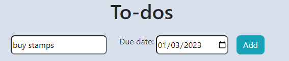

# Rosie's To do list 

Rosie's To Do List is a simple task storing website that allows you to record tasks and mark them as complete. Tasks can also have a priority status of red, amber or green. Taks are automatically sorted by date too.

   
  

---

## CONTENTS  
  
* [UXD (User Experience Design)](#user-experience-ux)
  * [User Stories](#user-stories) 
* [Creation process (Strategy -> Surface)](#creation-process)
  * [Wireframes](#wireframes)
* [Design](#design)
  * [Colour Scheme](#color-scheme)
* [Page Features](#page-features)
  * [Navbar](#navbar)
  * [Hero-Image](#hero-image)
  * [Tagline & Call to Action](#tagline--call-to-action)
  * [Business Ethos](#business-ethos)
  * [Menu Page](#menu-page)
  * [Contact Page](#contact-page)
  * [Footer](#footer)  
* [Tablet & Mobile View](#tablet--mobile-view)
  * [Desktop, Tablet & Mobile Differences](#desktop-tablet--mobile-differences)
  * [Tablet View](#tablet-view-ipad-miniipad-prosurface-pro)
  * [Mobile View](#mobile-view-iphone-5iphone-seiphone-xriphone-12-pro)
* [Future Features](#future-features)
* [Technologies Used](#technologies-used)
  * [Languages Used](#languages-used)
  * [Frameworks, Libraries, Technologies & Programs Used](#frameworks-libraries-technologies--programs-used)
* [Deployment](#deployment)
  * [How to deploy](#how-to-deploy)
* [Testing](#testing)
  * [HTML Validation using W3C Validation](#html-validation-using-w3c-validation)
  * [CSS Validation using W3C Validation](#css-validation-using-w3c-validation)
  * [Lighthouse scores via Chrome Developer Tools](#lighthouse-scores-via-chrome-developer-tools)
  * [Bugs & Fixes](#bugs--fixes)
  * [Unsolved Bugs](#unsolved-bugs)
* [Credits](#credits) 

  
---    

## User Experience (UX)  
  
### **User Stories**  

### **Primary Goal**  
  
Rosie's ToDo List is meant to be an easy to use simple website that fulfills the goal of storing tasks, organising them by date and highlighting their priority status. The website therefore needed a simple design with a clear table of task contents.

## Creation Process  
  
### **1. Strategy**  

- The site needed to be functional and bright so that different tasks can easily be distinguished from one another.
- The tasks needed to be listed in date and time order in order to allow the user to see which tasks needed to completed soonest.
- The tasks needed to be able to colour coded in order to allow the user to see which tasks were most important. This is done using the green, amber, red colour system which makes it visually very easy to see which tasks are more important.
  

### **2. Scope**  

This project needs to be a list of 

### **3. Structural**  

The site needed to contain 3 lists of tasks:
- Tasks for today
- Tasks for this week
- Tasks for the future

The typography needs to be clear to label each list and also clear to direct the user to the 3 lists easily.

The title of the tables should have a background colour different to the rest of the table.

Each task should have a description, due date and be contained in it's own row. 

Each task can be prioritised by colour. This colour should change running through the colours: amber, green, red upon being clicked.
  
### **4. Skeleton**  

The site was developed to be very clear and easy to use. It's clear immediately that the page is a To-Do list and the input box and "add" button are placed at the top of the page for immediate task addition. Each task has a "complete" button, see the wireframes for a visual representation of this.

### Wireframes  

Wireframe - Rosie's ToDo List
  

 

### **5. Surface**  

 A design was created that shows exactly what the page is for and does upon first glance.   
 - The background is grey to allow the design to be a little less garish. This design uses a lot of bright colours and the contrast is enough without pure white in the background.  
- Red, amber and green are used to establish the priority status of a task, this is familiar to the user as it is like a traffic light system. 
- Corners on all elements were rounded in order to make the website feel friendly and fun as opposed to sharp and serious.

The design intended to feel fun and friendly.
 
---   
  
  
## Design  

### **Color Scheme**  

This website used a palette of 6 colours. 3 of them were for the tables and background, these are blues and greys. I chose these are they are calm and in contrast to the traffic light colours used to prioritise tasks. 
  
  
    

## Page Features  

### **Add task button**   

  

 

This is featured at the top of the page so that the user can see immediately what the website does and how to add a task.
  
   

### **Tables**  

  

  
  
  

The above screenshots show the individual task tables from the site. These remain the same with the addition of tasks added by the user and removal of tasks in response to the user clicking the "complete" button.

  
---   

## Tablet & Mobile View  
 
### **Desktop, Tablet & Mobile Differences**  
  
To ensure responsivity I used Bootstrap framework grid system.
  
### **Tablet View (iPad Mini/iPad Pro/Surface Pro)**  
  

### **Mobile View (iPhone 5/iPhone SE/iPhone XR/iPhone 12 Pro)**  
  

---  
                              

## Future Features  

- Edit task function: At the moment you can only delete a task and rewrite it if you need to add detail or change anything.
  
---   
  

## Technologies Used    

### **Languages Used**   

- HTML5
- CSS3
- Javascript

### **Frameworks, Libraries, Technologies & Programs Used**  

- Canva - used to create wireframes
- Bootstrap - framework for the site 
- GitHub - used to save and store all files for this website  
- Git - used for version control
- Google Dev Tools - to debug and for testing responsiveness 
- Google Lighthouse - for auditing the website
- W3C Validator - for validating the HTML and CSS code 

---   

## Deployment

### **How to deploy**  

GitHub was used to deploy the website. These were the steps taken to acheive this:  

1. From your GitHub account find the following project repository: https://github.com/rosiethesupergeek/To-do-list
3. Click the Settings button.
4. In the left-hand menu, find and click on the Pages button
5. In the Source section, choose 'main' from the drop-down, select branch menu
6. Select 'root' from the drop-down folder menu
7. Click 'Save' and after a few moments the project will have be live.

---

## Testing  

### **Initial testing plan**
I used Chrome Dev tools to test the site on the following devices:

- Acer Aspire 3 Laptop (1920 X 1080)  
- Huawei AD80HW 24" Monitor
- iPad Pro 2021
- iPhone SE(2016)
- Huawei p30 Lite 
- iPhone 11/13
- Samsung Galaxy s10 
  
### **Testing**    

Testing took place throughout the entire build using Dev Tools on Chrome and on the above real-world devices. The browsers used were:  
- Chrome  
- Edge  
  
I also used Chrome devtools to test the site on the following devices:
  - iPhone 4/5/6/7/8
  - iPhone XR/ iPhone 12 Pro
  - Pixel 5
  - Samsung Galaxy s20

 
### **HTML Validation using W3C Validation**  

Rosie's ToDo List HTML and JSHint validator testing
  

   

Rosie's ToDo List HTML validation
  

  

   

### **Lighthouse scores via Chrome Developer Tools**   
  
For Desktop & Mobile  

Lighthouse audit for mobile and desktop
  

  

 
  
### **Bugs & Fixes**  
  
| Bug | Section | Fix |
| :----| :----| :--------:|
| Page would not run after putting together the load and save functions | All pages | Using Dev Tools, I used console.log to find out where the problem was. The console was returning null or undefined rather than a date value. To solve this I used the error guidance in the Dev Tools which pointed to the date array object not being defined. It turned out that I had not put the appropriate double quotation marks around the date object. |
| Problems with the date function | All pages | I had trouble sorting out the date in order to use it to then filter the tasks by date. The main problem with this was that the date needed to be turned into a format that would make sense to the user. I had to review the use of the date function in order to understand and do this. I visited tutorials by Net Ninja and also a fellow developer in order to understand how to do this. |

## Credits  
  
### **Content References**
- [W3Schools](https://www.w3schools.com/) for learning material.
- [NetNinja](https://netninja.dev/) for help in understanding Bootstrap grid system and javascript.

### **Acknowledgements** 
- 
